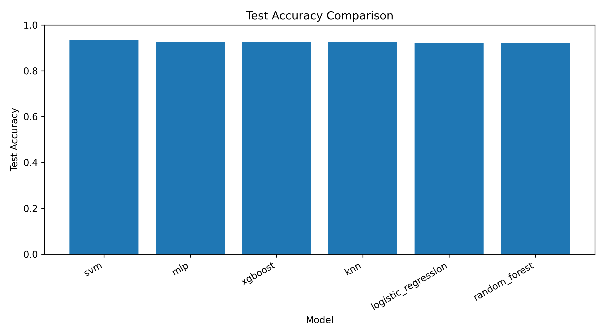
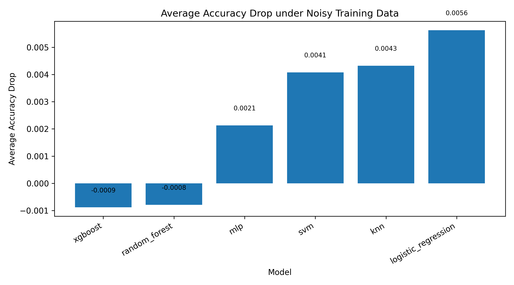

# DryBean_ML

Dry Bean Dataset multi-class machine learning project for data cleaning, feature engineering, model comparison, robustness analysis, and Streamlit-based result presentation.

[GitHub Repository](https://github.com/Alberttaa/DryBean_ML)

## Overview

This project organizes the full Dry Bean workflow into a reproducible machine learning pipeline:

- data quality analysis
- preprocessing and feature engineering
- multi-model training and evaluation
- loss and overfitting analysis
- robustness experiments
- Streamlit app for result presentation

The project uses [main.py](main.py) as a unified CLI entrypoint.

## Models Included

| Model | Category | Notes |
| --- | --- | --- |
| Logistic Regression | baseline | linear classifier |
| KNN | baseline | distance-based classifier |
| SVM | baseline | margin-based classifier |
| MLP | baseline | neural network classifier |
| Random Forest | extended | ensemble tree model |
| XGBoost | extended | boosted tree model |

## Dataset

The repository uses the provided dirty train/validation/test split:

```text
data/raw/Dry_Bean_Dataset_Dirty_train.csv
data/raw/Dry_Bean_Dataset_Dirty_val.csv
data/raw/Dry_Bean_Dataset_Dirty_test.csv
```

The target contains 7 classes:

```text
BARBUNYA, BOMBAY, CALI, DERMASON, HOROZ, SEKER, SIRA
```

The dirty data includes:

- missing values
- illegal characters such as `?`
- unit contamination such as `0.8194 cm`
- noisy labels such as `D3RMAS0N`
- non-physical values such as `Area <= 0`
- duplicate rows in the training split

## Project Structure

```text
DryBean_ML/
|-- app/
|   `-- app.py
|-- data/
|   |-- raw/
|   `-- processed/
|-- results/
|   |-- figures/
|   |   `-- confusion_matrices/
|   `-- metrics/
|-- saved_models/
|-- src/
|   |-- algorithms/
|   |-- evaluation/
|   |-- training/
|   |-- data_analysis.py
|   `-- preprocess.py
|-- .gitignore
|-- main.py
|-- README.md
`-- requirements.txt
```

## Key Results

Summary from [results/metrics/accuracy_summary.csv](results/metrics/accuracy_summary.csv):

| Model | Test Accuracy | Macro F1 | Train-Test Gap |
| --- | ---: | ---: | ---: |
| Logistic Regression | 0.9222 | 0.9327 | 0.0026 |
| KNN | 0.9247 | 0.9351 | 0.0753 |
| SVM | 0.9361 | 0.9459 | 0.0006 |
| MLP | 0.9266 | 0.9360 | 0.0040 |
| Random Forest | 0.9214 | 0.9320 | 0.0786 |
| XGBoost | 0.9255 | 0.9369 | 0.0281 |

Highlights:

- `SVM` currently has the best test accuracy and macro F1.
- `Logistic Regression` is a strong and stable linear baseline.
- `KNN` and `Random Forest` show larger train-test gaps than the other models.

## Visual Preview

### Accuracy Comparison



### Robustness Summary



## Preprocessing Pipeline

The preprocessing stage includes:

1. cleaning noisy labels and inconsistent capitalization
2. converting non-numeric tokens to missing values
3. fixing invalid physical values
4. removing duplicate training rows
5. filling missing values with training-set medians
6. label encoding for the 7 bean classes
7. feature standardization with `StandardScaler`

Generated outputs include:

```text
data/processed/X_train.csv
data/processed/X_val.csv
data/processed/X_test.csv
data/processed/y_train.csv
data/processed/y_val.csv
data/processed/y_test.csv
```

## Quick Start

Install dependencies:

```bash
python -m pip install -r requirements.txt
```

Run data analysis:

```bash
python main.py --mode analyze
```

Run preprocessing:

```bash
python main.py --mode preprocess
```

Train all models:

```bash
python main.py --mode train_all
```

Evaluate all models:

```bash
python main.py --mode evaluate
```

Run loss analysis:

```bash
python main.py --mode loss_analysis
```

Run robustness experiments:

```bash
python main.py --mode robustness
```

Launch the Streamlit app:

```bash
python -m streamlit run app/app.py
```

## Main Output Files

Metrics:

```text
results/metrics/accuracy_summary.csv
results/metrics/speed_summary.csv
results/metrics/overfit_summary.csv
results/metrics/loss_analysis_summary.csv
results/metrics/robustness_summary.csv
results/metrics/classification_reports.json
```

Figures:

```text
results/figures/accuracy_comparison.png
results/figures/loss_curve_comparison.png
results/figures/speed_comparison.png
results/figures/overfit_comparison.png
results/figures/robustness_average_drop.png
results/figures/confusion_matrices/
```

## Streamlit App

The Streamlit interface in [app/app.py](app/app.py) reads saved experiment outputs and presents:

- project overview
- data quality issues
- preprocessing workflow
- model comparison
- confusion matrices
- loss analysis
- speed comparison
- overfitting analysis
- robustness analysis

## Git Tracking Notes

- Source code, processed data, metrics, and figures are tracked for reproducibility and presentation.
- Trained model files under `saved_models/` are ignored to keep the repository smaller.
- Python caches, virtual environments, logs, and local editor files are ignored by `.gitignore`.

## Future Improvements

- hyperparameter search
- PCA-based comparison experiments
- feature importance analysis
- SHAP-based interpretability
- public demo deployment
